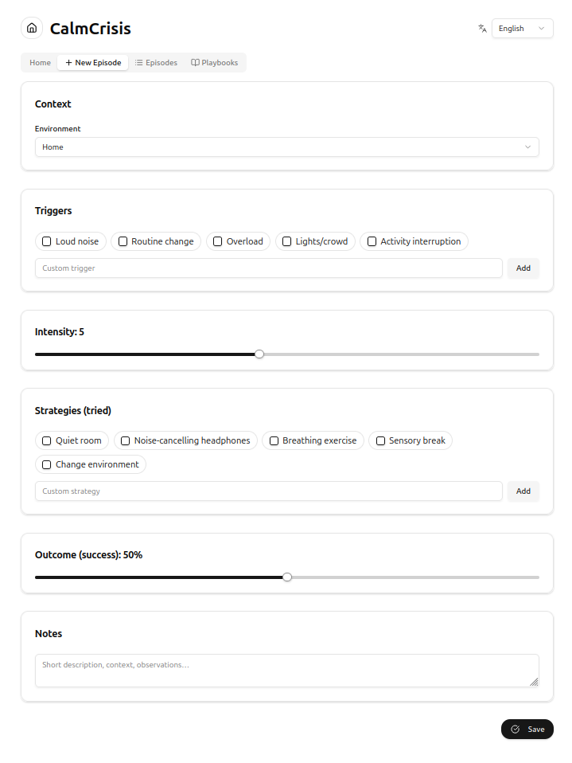
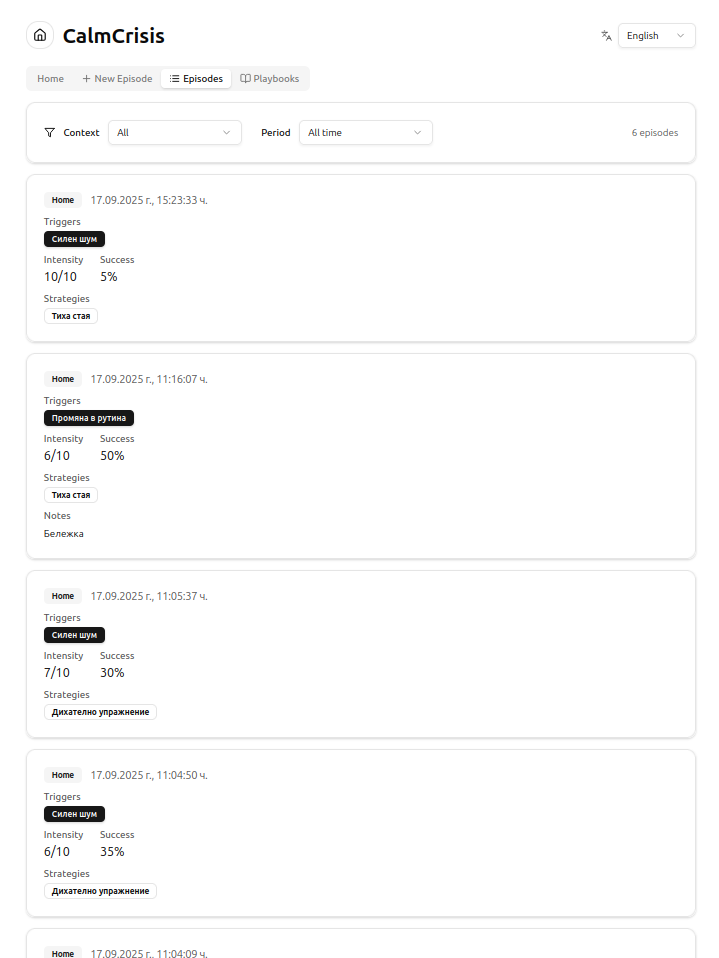
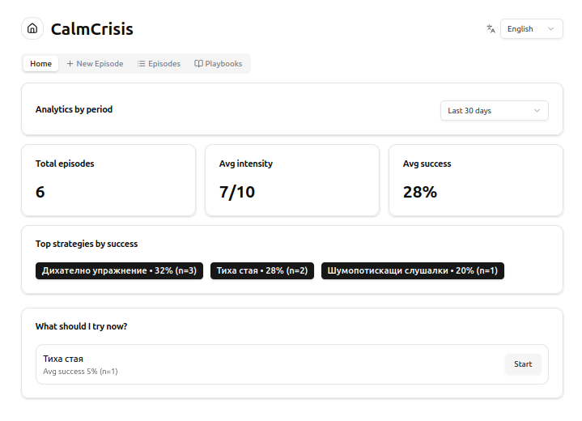

# CalmCrisis (PWA, offline-first)

A lightweight app to quickly log crisis episodes (triggers → strategies → outcome) and get simple recommendations based on similar situations.

## Why
- Works fully **offline**, data is stored **locally** (IndexedDB).
- Fast episode logging, filters by period/context, mini analytics.

## Demo
[Live demo](#) • [Short video/GIF](#)

## Tech stack
React + TypeScript, Dexie (IndexedDB), PWA (manifest + SW with graceful fallback).

## Run locally
```bash
npm i
npm run dev
```

## Screenshots & Demo








```

## Roadmap
- [ ] CRUD for playbooks
- [ ] Export / import (JSON)
- [ ] Improved recommendations and visualizations
